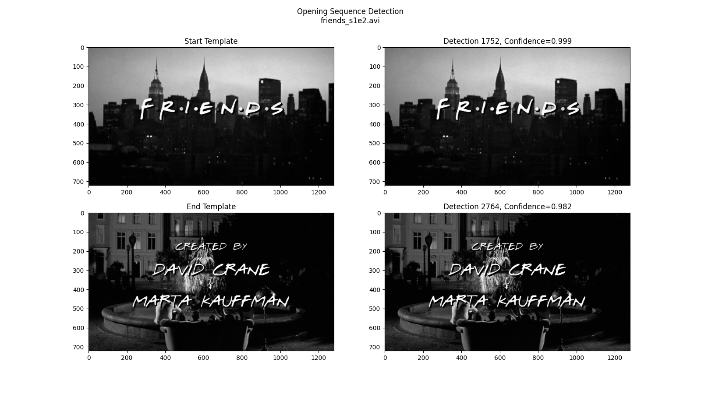

# Opening Sequence Detection with opencv
Opening sequence detection with opencv in python. Primarily intended to find the timecode pair of the start and end of a repeated video segment across similar videos. However, it could be adapted simply to find the timecode of a screen grab in a video.



## Requires
```
python > 3.7
opencv-python
matplotlib (for reporting)
numpy (should have been included in opencv-python)
```
To resolve common import issues, try the following:
```
reinstall the latest version of python here: https://www.python.org/downloads/
sudo python3 -m pip install opencv-python
sudo python3 -m pip install matplotlib
```

## getImage.py
A command line screen grab helper is included. This can be used to get the image at a specified frame.
```
python3 getImage.py <video_path> <frameCount> <outputName>

e.g.
    python getImage.py friends_s1e3.avi 2020 start

@ out:
    'templates/start.png'
```

## detect.py
Runs detection on a given video based on the pair of images in "./templates/".
```
python3 getImage.py <video_path> <start_img> <end_img>

e.g.
    python getImage.py friends_s1e2.avi 'templates/start.png' 'templates/end.png'
@ out:
    [[1752, 0.9995321035385132]]
    [[2764, 0.9821252822875977]]
    result.png
```
